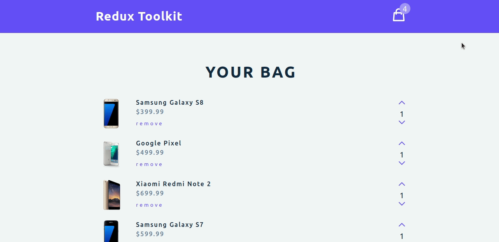

# Shopping Cart

> This code was built following a [Redux Toolkit Tutorial – JavaScript State Management Library](https://www.youtube.com/watch?v=bbkBuqC1rU4). It is a mobile store cart where we can increment and decrease the quantities of the items in the cart, clear the cart, check the quantity of items in it and the total price.



## Setup

### Clone this repository

```bash
$ git clone git@github.com:Sahar-AbdelSamad/shopping-cart.git
$ cd shopping-cart
```

### Run project

```bash
$ npm install
$ npm run start
```

## Live Demos

- [Github Deployment](https://sahar-abdelsamad.github.io/shopping-cart/)


## Built With

- ReactJS
- Redux Toolkit
- JavaScript
- CSS

## Authors

👤 **Sahar Abdel Samad**

- GitHub: [@sahar-abdelsamad](https://github.com/Sahar-AbdelSamad)
- Twitter: [@abdelsamadsahar](https://twitter.com/AbdelSamadSahar)
- LinkedIn: [abdel-samad-sahar](https://www.linkedin.com/in/sahar-abdel-samad/)

## 🤝 Contributing

Contributions, issues, and feature requests are welcome!

Feel free to check the [issues page](https://github.com/Sahar-AbdelSamad/shopping-cart/issues).

## Show your support

Give a ⭐️ if you like this project!
